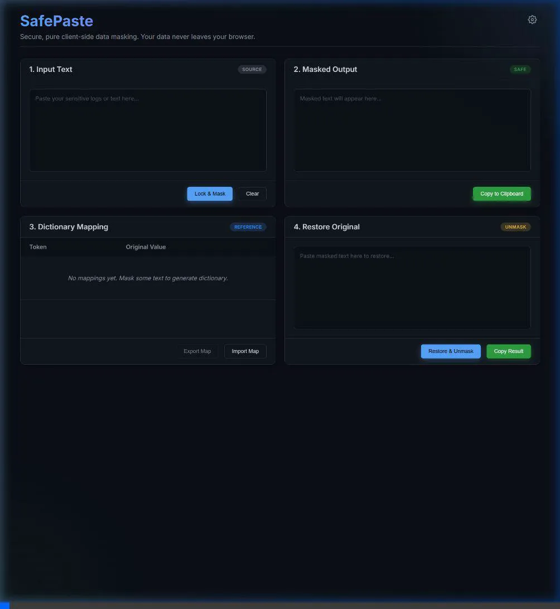

# SafePasteWeb

SafePasteWeb is a completely static, pure client-side application designed to safely mask sensitive information—such as IP addresses, domains, and custom secret keywords—from your text before you share or paste it elsewhere. 

**Privacy First:** Your data never leaves your browser. Because it is built with vanilla HTML, CSS, and JavaScript, everything runs locally on your machine with absolutely no server egress.

---

## 🚀 Features

- **Automated IP Masking**: Automatically detects and masks IPv4 and IPv6 addresses.
- **Automated Hostname Masking**: Detects and masks domains and hostnames (including complex/long TLDs like `.internal`).
- **Custom Keywords**: Define your own secret keywords or tokens in the Settings menu to have them automatically scrubbed from your logs.
- **Dictionary Mapping**: Generates a synchronized, reversible mapping table (e.g., `[IP_1] -> 192.168.1.1`).
- **Restore / Unmask Engine**: Easily reverse the masking process and completely restore the original text using the generated dictionary.
- **Import / Export**: Save your active dictionary mapping as a `.json` file, or import previous mappings to ensure consistency across sessions.
- **Premium UI**: Designed with a responsive, dark-mode glassmorphism aesthetic for an amazing user experience.

---

## 🎥 How it Works

Here is a quick demonstration of the SafePasteWeb masking and restoration engine in action:

Because SafePasteWeb relies on a local Dictionary State (`Map()`), tokens are tracked sequentially. If `192.168.1.1` becomes `[IP_1]`, any subsequent occurrence of that exact IP in your text will also reliably map to `[IP_1]`.

---

## 🛠 Usage

1. **Host it anywhere:** Since it's purely static, you can host the files (`index.html`, `styles.css`, `script.js`) on GitHub Pages, Vercel, Netlify, or simply open `index.html` directly in your browser (`file:///...`).
2. **Configure Rules (Optional):** Click the ⚙️ Settings icon in the top right to turn off IP/Hostname masking or to add your comma-separated custom keywords.
3. **Lock & Mask:** Paste your sensitive logs into the `1. Input Text` panel and click **Lock & Mask**.
4. **Copy Safe Data:** The redacted result will appear in `2. Masked Output`, ready to be safely shared with AI assistants, support staff, or public forums. 
5. **Restore:** To retrieve the original data, paste the masked text back into `4. Restore Original` and click **Restore & Unmask**.

---

## 💻 Tech Stack
- **HTML5**: Semantic web structure.
- **CSS3 Vanilla**: Used for layouts via CSS Grid and Flexbox, custom UI controls (toggles, scrollbars), and modern aesthetic styles. 
- **JavaScript (ES6)**: Core RegEx mapping operations, State Management with `Map`, LocalStorage API for configuration persistence, and robust event handling.

## 📄 License
MIT License
